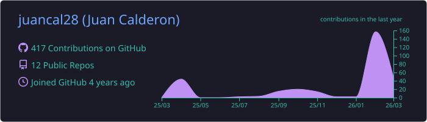
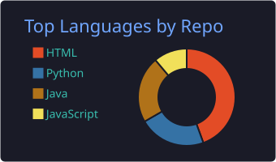
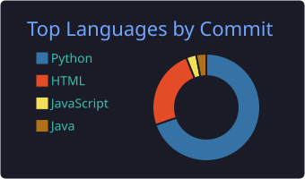
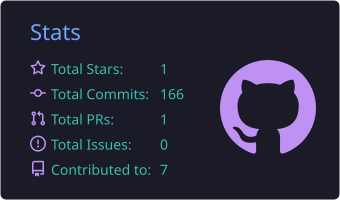

# Welcome to my GitHub!

## About Me

- **EECS student at the University of California, Berkeley** with research experience at Emory University and Georgia Institute of Technology
- **Former SDE Intern at AWS**, where I built CI/CD pipelines, developed RAG agents, and coordinated a team of 6 interns on multi-agent applications
- **Published researcher** with a peer-reviewed paper on computational drug discovery and a pending US patent on RNA polymerase inhibitory compounds
- Passionate about **algorithm design, creating full-stack applications**, and the mathematics behind computer science

## Current Projects

### [Homely](https://github.com/juancal28/homely)
A full-stack marketplace platform connecting homeowners with skilled trade professionals for home-building and renovation projects. Homeowners can browse verified contractors, discover land listings, schedule appointments, and manage projects end-to-end. Professionals get a dedicated portal to manage jobs, earnings, and client communication. Features an AI Design Advisor powered by a custom RAG pipeline with Claude and LangChain.

**Tech:** React, TypeScript, Node.js, Express, PostgreSQL, Tailwind CSS, Anthropic Claude, LangChain, Capacitor (iOS/Android), Cloudinary, Railway

### [quantAlgoV1](https://github.com/juancal28/quantAlgoV1)
A production-grade paper trading system that autonomously ingests financial news, proposes AI-assisted strategy adjustments validated via rigorous backtesting, and executes paper trades with full risk management. The pipeline includes news ingestion, FinBERT sentiment analysis, a Claude-powered RAG agent for strategy proposals, dual-window backtesting (in-sample + out-of-sample), human-in-the-loop approval gates, and a paper broker with circuit breakers and position limits.

**Tech:** Python, FastAPI, Celery, Redis, PostgreSQL, Qdrant, FinBERT, Anthropic Claude, Alpaca API

## Skills

- Algorithm Design & Data Structures
- Full-Stack Web Development
- Cloud Infrastructure & CI/CD
- Computational Research & Drug Discovery
- AI Agent Development & RAG Systems
- Cluster Computing & High-Performance Computing

## Tech Stack

### Languages

### Frameworks & Libraries

### Tools & Platforms

## GitHub Stats

  
   
  
  
   
  
   
  

